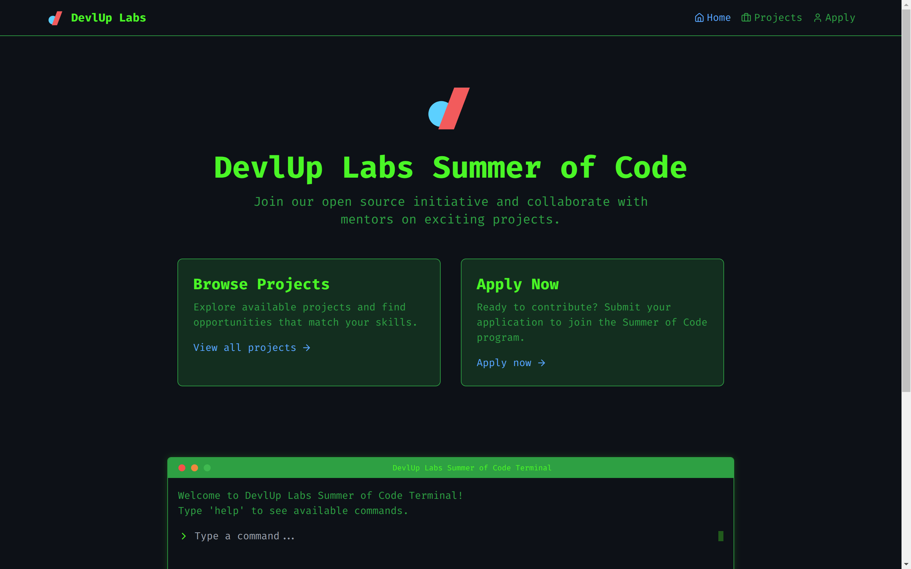

# 💻 DevlUp Labs Summer of Code

<div align="center">

[](https://www.typescriptlang.org/)
[](https://reactjs.org/)
[](https://tailwindcss.com/)
[](https://vitejs.dev/)

</div>


## 📷 Preview


*Home interface of the DevlUp Labs Summer of Code site*
## 📋 Overview

A terminal-themed web application for the DevlUp Labs Summer of Code program that connects students with open-source projects. This interactive platform allows users to explore projects, learn about mentors, and apply to contribute using a unique terminal-like interface.

## 🚀 Features

- **Terminal Interface**: Navigate the application using command-line style interactions
- **Project Exploration**: Browse, search, and filter available open source projects
- **Mentor Directory**: Access information about project mentors and their expertise
- **Interactive Application**: Apply to projects directly through the interface
- **Responsive Design**: Works seamlessly across desktop and mobile devices

## 🖥️ Terminal Commands

```bash
help               # Display available commands
clear              # Clear terminal history
projects           # List all available projects
search [query]     # Search for projects by keyword
filter [tech]      # Filter projects by technology
view [id]          # View details of a specific project
mentors            # Show all project mentors
apply              # Open the contributor application form
```

## 🔧 Tech Stack

- **Frontend**: React with TypeScript
- **Styling**: Tailwind CSS with custom terminal theme
- **Build Tool**: Vite for fast development
- **Data Source**: Google Sheets integration
- **Form Handling**: React Hook Form with client-side validation
- **Routing**: React Router for seamless navigation
- **Icons**: Lucide React for clean, minimal icons

## 🛠️ Installation & Setup

1. **Clone the repository**
   ```bash
   git clone https://github.com/your-username/devlup-soc.git
   cd devlup-soc
   ```

2. **Install dependencies**
   ```bash
   npm install
   # or
   bun install
   ```

3. **Environment setup**
   - Copy `.env.sample` to `.env`
   - Add your Google Sheets CSV URL and Form URL

4. **Start development server**
   ```bash
   npm run dev
   # or
   bun dev
   ```

## 🤝 Contributing

Contributions are welcome! Please feel free to submit a Pull Request.

1. Fork the repository
2. Create your feature branch (`git checkout -b feature/amazing-feature`)
3. Commit your changes (`git commit -m 'Add some amazing feature'`)
4. Push to the branch (`git push origin feature/amazing-feature`)
5. Open a Pull Request

## 📄 License

This project is licensed under the MIT License - see the LICENSE file for details.

## 🙏 Acknowledgements

- [DevlUp Labs](https://devluplabs.tech/#/) for organizing the Summer of Code program
- All mentors who contribute their time to guide students
- PES University for supporting open source initiatives

---

<div align="center">
Made with ⚡ by DevlUp Labs Summer of Code Team
</div>
